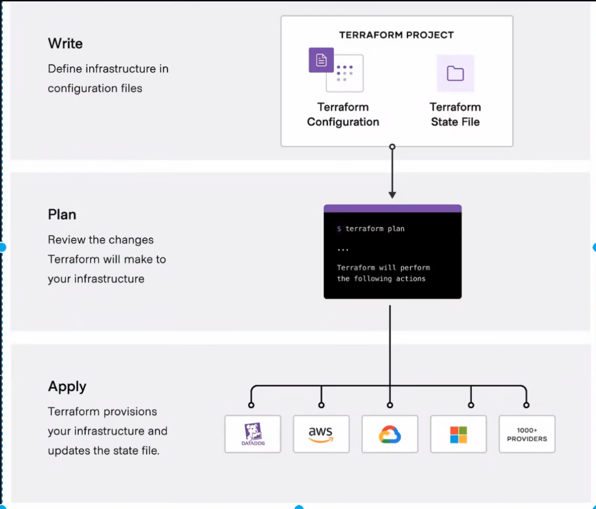
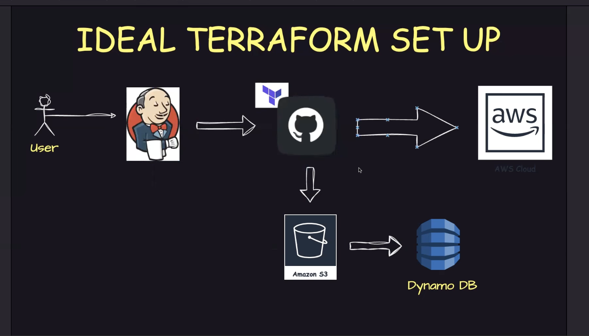

# Terraform Notes

## How Terraform Works

Terraform internally uses the providers apis for creation of the resources. 
And for communicating with the help of the apis it is required to be authenticated with the provider. 

## Terraform Lifecycle

As shown in the image a typical terraform flow looks like this -
- Writing infra config in .tf files 
- Reviewing the changes that will be applied to the infra/ Dry run
- Applying the infra changes on the cloud provider/ creating actual resources on the cloud provider

## Basic Commands

`terraform init` - used for intialized a terraform project with the configured providers

`terraform plan` - used to review the changes that terraform is going to apply 

`terraform apply` - used for applying the configured changes to the providers

## State file in Terraform

- Terraform uses state file to keep the track of the infrastructure. 
- It also contains sensitive information related to the infrastructure so the state files should not be shared publicly and also It should not be pushed to public repos. 
- It should be placed on a central place so multiple developers can work with it.
- Deleting or misconfuring the state file leads to lose the track of the infra
- Developers should never manipulate state files on their own.

## Remote backends

Terraform by default stores the state file on local but due to the sensitive information of the infrastructure and to keep the file on a central place so the developers can work with it easily, it's a good practice to keep the file on a remote storage location, which are known as remote backend in Terraform.
Also these files should have read-only permissions so it's cannot be modified by anyone.

## State Locking in Terraform

In the real world, multiple developers will be working with Terraform. Think of a scenario where multiple developers parallely changing the infra by executing the scripts. 
In such scenario, there're are chances that the changes will be overriden and the infra will be inconsistent so it is required that only a single execuation should change the state file at a time.

## Problems with Terraform

- The State file is the single source of truth. if misconfigured or deleted will leads to infra loss.
- Terraform does not track bi-directional changes, which means if anything on the provider is changed manually then automatically the state files won't be updated.
- It is not a gitops friendly tool so it does not play well with tools like flux and argo cd
- It may become verry complex and difficult to manage
- Terraform is trying to position as a config management tool as well same as ansible is trying to be infra management tool.
