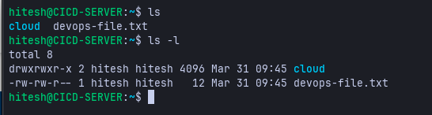
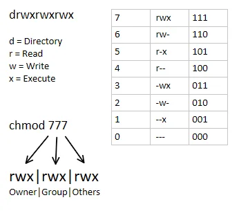
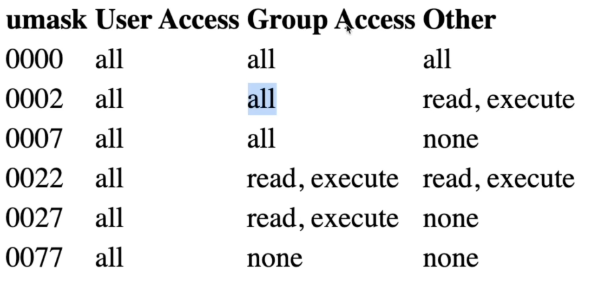
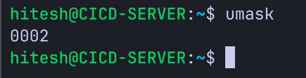
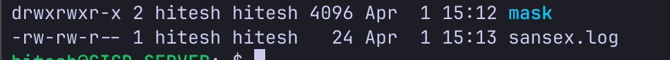

# Day 5 - File System Management in Linux

---

## File/Dir Permissions




`drwxrwxr-x` breakdown -

- `d` - directory
- 3 sets of permission combinations:
  - `rwx` - file owner can read, write, execute (owner is hitesh, since it's created by hitesh)
  - `rwx` - file group can read, write, execute (group is hitesh, since the default group of the file owner is hitesh)
  - `r-x` - other users can only read and execute



### chmod - changing permissions

```
chmod 700 <file/dir-name>       # change rwx permission for user, group and others
chmod u=rwx,go= <filename>      # same, using symbolic mode
chmod u+rwx <filename>          # same, add rwx to user
```

the permissions of a file/dir can only be changed by the owner of the file/dir or the root user itself.

---

## Umask



umask is a file system setting and command that specifies the default permissions for newly created files and directories.

every system has a maximum set of permissions defined for files and directories -
- directories default to `777` - owner, group and others have full permissions
- files default to `666` - owner, group and others can read and write, but no execute (security purposes)



with `umask 0002` set, permissions are applied like -

```
777 - 0002 = 775   # dirs  -> owner and group have full access, others can read and execute
666 - 0002 = 664   # files -> owner and group can read and write, others can only read
```



umask setting can be changed and will be applied to dirs and files created after the change.

### chown / chgrp

```
sudo chown <username> <file/dir-name>     # change the owner of a file or directory
sudo chgrp <group-name> <file/dir-name>   # change the group of a file or directory
```

---

## Compress and Archiving

zip can do both compress and bundling (archiving) -

```
zip -r <zip-name.zip> <folder-name>   # zip a folder recursively
unzip <zip-file>                      # unzip a zip file
```

alternates: `gunzip`, `gzip`, `7zip`

tar is most commonly used in linux (by default it bundles files, but we can pass arguments to also compress it) -

```
tar -cvzf <name.tar.gz> <folder/file-name>   # compress and bundle into a gzip archive
# c - compress, v - verbose, z - gzip, f - file

tar -xvzf <tar.gz-file>                      # extract the tar file in the current dir
```

---

## Transferring Files - Local <-> Remote

### scp (secure copy protocol)

```
# local -> remote
scp -i <key.pem> <local-file-path> user@host:<remote-destination-path>

# remote -> local
scp -i <key-path> -r user@host:<remote-file-path> <local-destination-path>
```

### rsync

a tool for syncing/copying from one machine to another (one-way synchronization)
