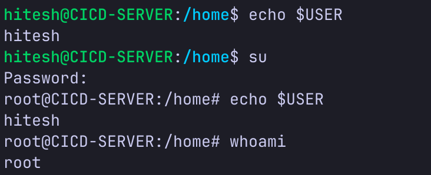
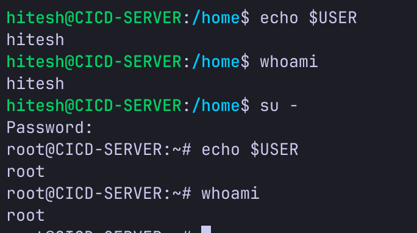

# Day 4 - User & Group Management with System Level Commands

---

## System Level Commands

```
uname        # prints the OS/kernel name
uptime       # shows CPU uptime, current active users and load avg
date         # prints the current date and time
who          # shows which user logged in at which time and related data
whoami       # shows the username of the current logged-in user
which        # shows where an installed program is located
id           # shows the uid, gid and groups for the current logged-in user
groups       # displays the groups for a specified user (or current user if none specified)
sudo         # run any command as superuser (user who has full access to the system)
```

---

## Package Management Basics

```
sudo apt update                     # update software distribution repos
sudo apt upgrade                    # install latest available version of installed packages
sudo apt install <package-name>     # install a package
sudo apt remove <package-name>      # uninstall a package
sudo apt purge <package-name>       # uninstall the package along with its config files
sudo apt autoremove                 # remove unused dependencies
```

> `apt` doesn't have a stable CLI interface — use `apt-get` and `apt-cache` for scripts (apt is based on these)

---

## User and Group Management

### Users in Linux

There are three types of users in linux -

- **Root** - superuser who has access to everything on the system
- **Standard Users** - regular login users with limited permissions
- **Service Users** - users created by applications/services to run in the background, login not allowed

```
sudo useradd -m <username>    # create a user with a home directory
sudo userdel <username>       # delete a user from the system
```

newly created users are locked by default. to switch to a newly created user you have two options -
1. create a password for that user first, then login using that password
2. switch using sudo, since it has privilege to bypass password checks

```
sudo passwd <username>    # create/set a password for a user
su <username>             # switch to a user (requires password; no username = switch to root)
```

### su vs su -

`su <username>` - switches to the given user account but does **not** reload the shell environment variables.



`$USER` still shows the previous user's name because shell env vars weren't reloaded.
always prefer `whoami` over `$USER` to see the actual current logged-in user.
also, `su` opens the new shell in the path where the previous user was.

`su - <username>` - switches to the user and reloads all shell environment variables and config. opens a fresh login shell inside the user's home directory.



### Important User Files

```
/etc/passwd    # contains the full user list of the system
/etc/shadow    # contains user password details (requires admin permissions)
```

---

## Groups in Linux

groups are used for managing permissions for users. two types -

- **Primary** - created automatically when a login user is created. has the same name as the login username. it's the default group for that user.
- **Secondary** - assigned to users for managing access to resources. a user can have multiple secondary groups.

example - the `sudo` group has admin permissions. any user assigned to it can run system-level operations using `sudo`.

### Group Management Commands

```
sudo groupadd <groupname>                        # create a group
sudo gpasswd <groupname>                         # set a password for the group
sudo gpasswd -a <user> <group>                   # add a single user to a group
sudo gpasswd -M <user1,user2,user3> <group>      # add multiple users to a group
sudo groupdel <group>                            # delete a group from the system
```

### Important Group Files

```
/etc/group     # contains the list of groups
/etc/gshadow   # contains the password list of the groups
```
